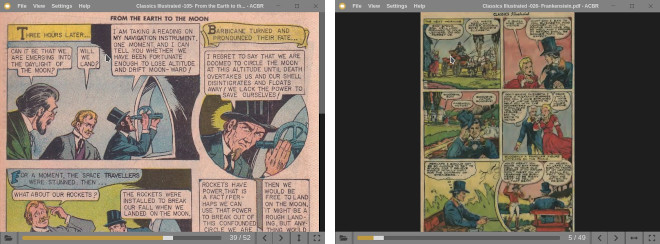

# ACBR - Comic Book Reader

A comic book reader for cbz, cbr and pdf files.

## Features:

- Windows & GNU/Linux versions.
- Compatible file formats:
  - .cbz
  - .cbr
  - .pdf
- Windowed (simple UI) and full-screen (no UI) modes.
- 'Fit to width' and 'fit to height' views.
- If available, it automatically restores the previous session's opened book and page, and remembers the last 10 books' page positions.

## Controls:

- Toolbar :
  - buttons: 'open file', 'previous page', 'next page', 'fit to width', 'fit to height' and 'toogle fullscreen'.
  - slider: use it to quickly go to any page in the book.
- Keys:
  - 'right arrow' or 'page down' to go the next page.
  - 'left arrow' or 'page up' to go to the previous one.
  - 'up arrow' to scroll the page up, 'down arrow' to scroll the page down.
- Mouse:
  - 'scroll wheel' scrolls the page up and down.
  - 'left-click' opens the next page if the right side of the view area is clicked and the previous one if the left side is clicked.
  - 'right-click' opens a context menu with some basic navigation options.

## Downloads

## License

ACBR's code is released under the BSD 2-Clause [License](./LICENSE). To check the licenses of the node modules and other libraries used in the project check the [licenses](./licenses/) folder.
